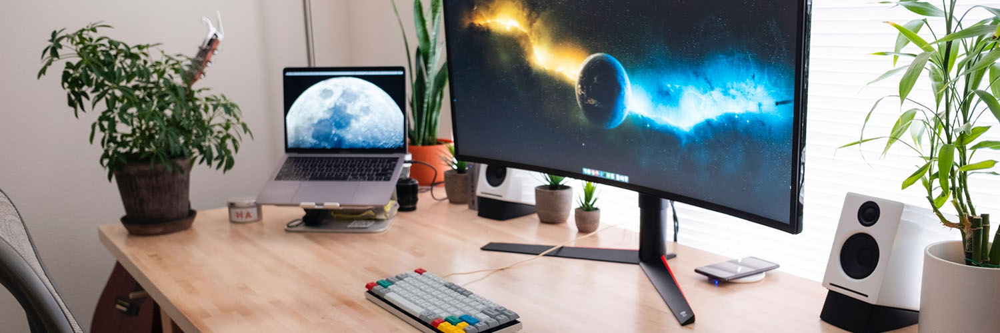

## Hi, I'm Andrey!

I'm a web developer from Moscow, Russia.    
Focused of frontend (React/TypeScript), using vanilla JavaScript, Next.js, Redux, Node/Express, MongoDB, Git, BEM, SASS, Webpack.

Cat lover and photographer in my free time. My interests are also include:  
🏯 Japan, 🎮 videogames, 👽 animation, 🖼 classic and modern art, 🏛 architecture

(Photo by <a href="https://unsplash.com/@lukepeters?utm_source=unsplash&amp;utm_medium=referral&amp;utm_content=creditCopyText">Luke Peters</a> on <a href="https://unsplash.com/s/photos/monitors?utm_source=unsplash&amp;utm_medium=referral&amp;utm_content=creditCopyText">Unsplash</a>)

💠 [**My Portfolio**](https://catlogic.ru/) 💠 [**Twitter**](https://twitter.com/cat__logic) 💠 [**LinkedIn**](https://www.linkedin.com/in/catlogic/)

---
 
